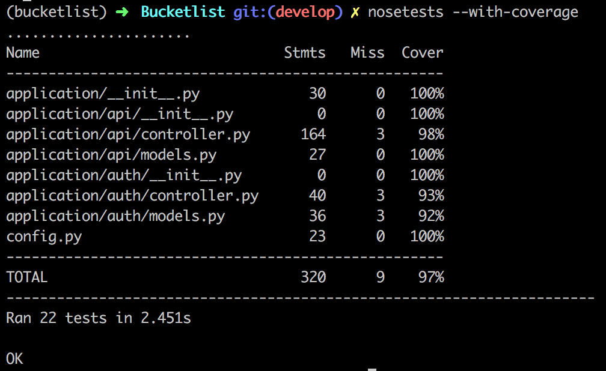

# Bucketlist API(Checkpoint 2)

[](https://travis-ci.org/andela-amutava/Bucketlist)
|
[](https://coveralls.io/github/andela-amutava/Bucketlist?branch=master)

BucketList API is a simple application built using the flask microframework. It's an application that helps users track what they want to do in the future. It is an API that can be consumed by other applications.

## Functionalities
```
User Registration/Login.
User create a bucketlist.
User can delete/ edit an existing bucketlist.
User can add items to an existing bucketlist.
User can delete/ edit items of a bucketlist

```
 

## Installation
1. Create a folder.

2. Clone the repository into the given folder.<br/>
    `https://github.com/andela-amutava/Bucketlist.git`<br/>
3. Navigate to the project folder.<br/>
   `Bucketlist` 

4. Install project dependencies in your virtual environment.<br/>
    ` pip install -r requirements.txt`


5.Set up project development. Run db migrations.<br/>
     ```python manage.py db init
        python manage.py db migrate
        python manage.py db upgrade
      ```
6. Run the server.<br/>
   `python manage.py runserver`

## Interaction with API
1. Intergrate your google chrome browser with post-man plugin.<br/>
2. Run your api url on postman.<br/>
3. Choose the appropriate method.<br/>
  * POST - For creating a resource.
  * GET - To obtain resources from the server.
  * PUT - Editing an existing resource.
  * DELETE - Deleting an existing resource.
4. Pass the required data for the particular methods for appropriate responses.

## Security
To achieve secure endpoints on login a user is issued with a token that expires in 10minutes. This token is used during reaching the bucketlist and bucketlists'  items endpoints. This is an authorization security mechanism.    


## API Endpoints

| URL Endpoint | HTTP Methods | Summary |
| -------- | ------------- | --------- |
| `/auth/register` | `POST`  | Register a new user|
|  `/auth/login` | `POST` | Login and retrieve token|
| `/api/bucketlists` | `POST` | Create a new Bucketlist |
| `/api/bucketlists` | `GET` | Retrieve all bucketlists for user |
| `/api/bucketlists/?limit=2&page=1` | `GET` | Retrieve one bucketlist per page |
| `/api/bucketlists/<id>` | `GET` |  Retrieve bucketlist details |
| `/api/bucketlists/<id>` | `PUT` | Update bucket list details |
| `/api/bucketlists/<id>` | `DELETE` | Delete a bucket list |
| `/api/bucketlistitems/<id>/items` | `POST` |  Create items in a bucket list |
| `/api/bucketlistitems/<id>/items/<item_id>` | `DELETE`| Delete a item in a bucket list|
| `/api/bucketlistitems/<id>/items/<item_id>` | `PUT`| update a bucket list item details|


### Testing
   `You can run the tests nosetests --with-coverage`

   
